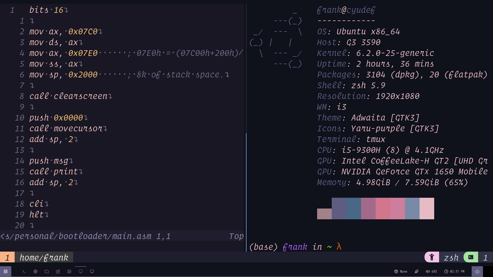

# dotfiles
should be included: 
- kitty term with pywal bg theming(uses Lexsa font) 
- nvim with srcery theme COLEMAK-Dh keybindings and telescope now sees hidden files
- i3 with docky polybar from polybar themes, no border or gaps 
- Lexsa and lemonade font https://www.sainnhe.dev/post/patch-fonts-with-cursive-italic-styles/
- rofi
- neovim is referenced in the zshrc file as "alias vim='~/Documents/./squashfs-root/usr/bin/nvim'", neovim is also contained in the dotfiles \
that is done because in most apt distros its very outdated(contained version is 9.1)

this is the default background(referenced in .Xsession as "feh --bg-scale ~/bgs/tst.png")

 

preview screenshot: 
OUTDATED!!
 

todo: 
- remove useless files and directories: done
- make an install stcript, since im a certified linux distro breaker(fuck nvidia drivers)

quick install links \
(no longer used, replaced by polybar pywall script) kitty-themes \
https://github.com/dexpota/kitty-themes#installation \
ohmyzsh\
https://ohmyz.sh/#install \
rustup \
curl --proto '=https' --tlsv1.2 -sSf https://sh.rustup.rs | sh \
Dont search for "packer' on google \
https://github.com/wbthomason/packer.nvim#quickstart \
rofi-themes \
https://github.com/adi1090x/rofi#installation \
tmux-plugins \
https://github.com/tmux-plugins/tpm#installation \

tmux-plugins that i had in the dotfiles failed to copy so its not present at all, the config file however is present \
 \
plugin list:

tmux sensible \
catppuccin tmux
